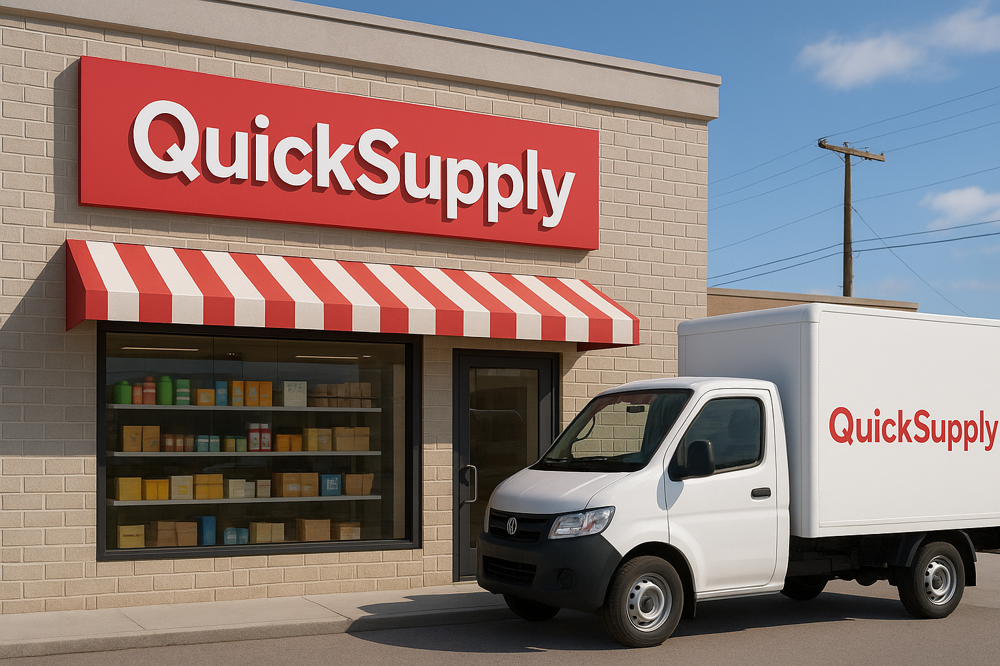
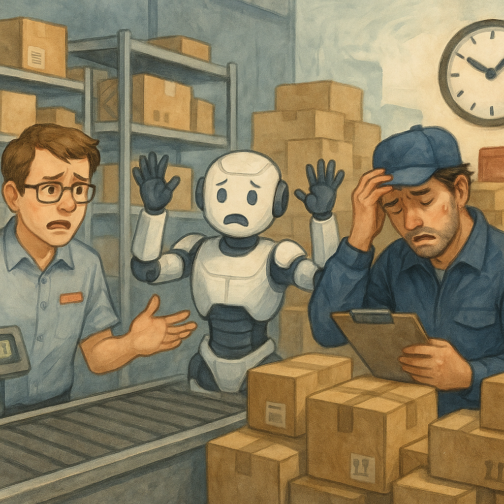
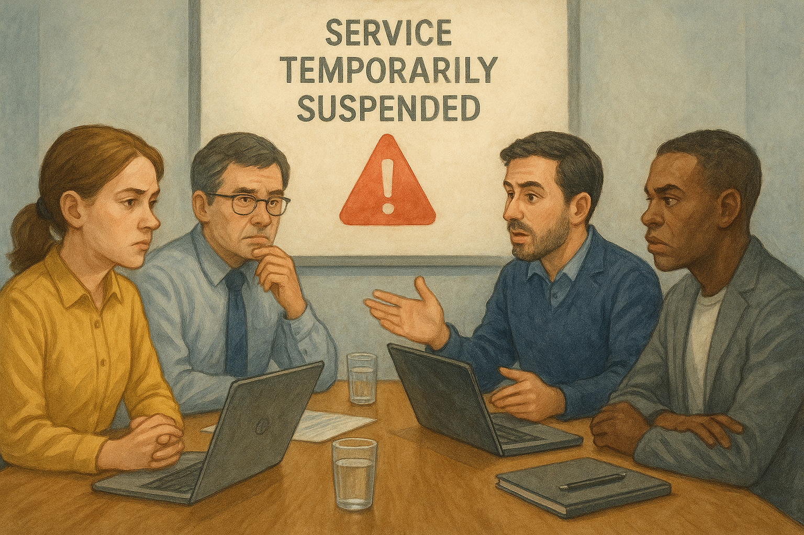

# はじめに

※この物語はフィクションです。

## 導入

株式会社 QuickSupply は、関東エリアに展開する大手チェーン店で、主に日用雑貨や食品を取り扱っています。QuickSupply のビジネスモデルは、各店舗に迅速に商品を供給することに特化しており、そのために商品の在庫は全て1箇所の中央倉庫に集約されています。商品は、倉庫からピックアップされ、トラックで各店舗に配送されますが、倉庫内ではすべてのピックアップ作業をロボットが行っています。

    

 

QuickSupply は、配送と在庫管理を最適化するために、DreamTech Solutions に依頼して、独自の倉庫管理システム「StoreLink」を導入しました。このシステムは、各店舗からの注文を管理し、倉庫内で商品をロボットがピックアップする際の最適なピックアップの組み合わせを計算することで、より効率的な商品供給を実現することを目的としていました。

StoreLink は、最初は非常にうまく機能しており、倉庫から店舗への配送の効率化が進み、業務の負担が大幅に軽減されました。しかし、事業の急成長とともに、店舗数や商品数が急増し、システムのパフォーマンスに重大な問題が発生し始めました。特に、商品ピックアップの最適な組み合わせを計算する処理が遅延し、また、注文の処理速度が低下する事態が発生しました。

    

 

倉庫内での商品ピックアップの遅延や、トラックの積載作業に影響が出ることで、配送スケジュールにも遅れが生じ、顧客に対する納期が守れなくなることが頻発しました。これは、QuickSupply の業務に深刻な影響を及ぼし、特に繁忙期では、大量の注文に対応できなくなり、営業やサポートチームは謝罪と問題解決に追われる日々が続くこととなりました。

    

 

このような状況を受けて、QuickSupply と DreamTech Solutions は、サービス提供を一時中断し、パフォーマンス改善に集中することを決定しました。DreamTech Solutions は、専用の「Performance Optimization Team」を結成し、限られた2日間の緊急メンテナンス期間でシステムのパフォーマンス改善を目指すこととなりました。

---

[最初にやること（VM の環境構築）](../setup/01_Start.md)

[トップ](../../README.md)
