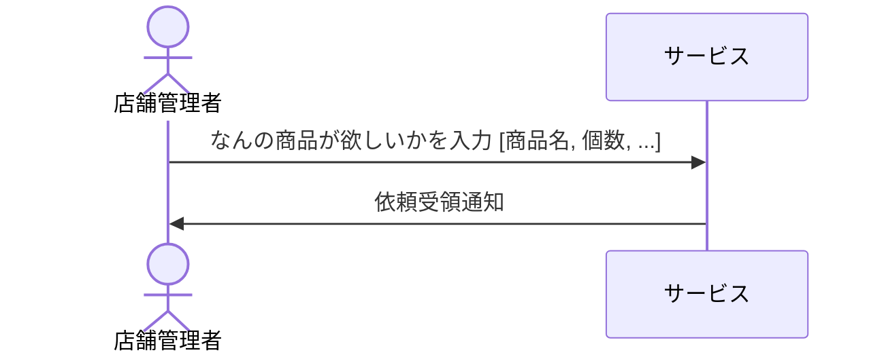
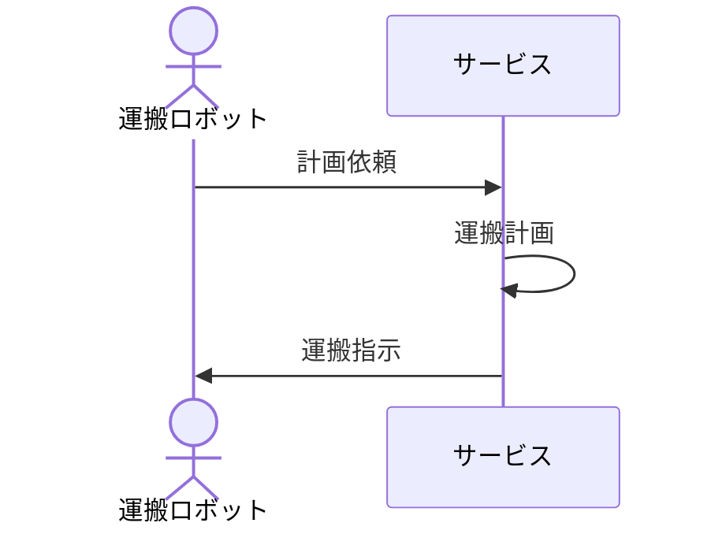
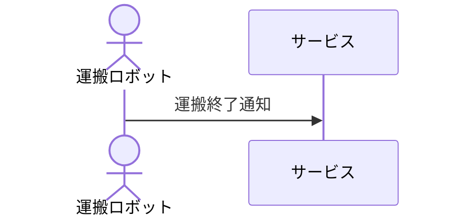
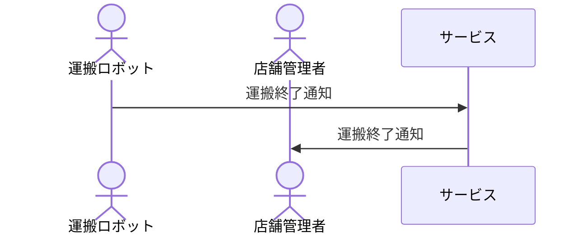
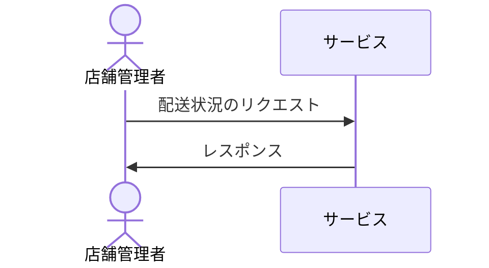

## ユースケース１：登録処理

```mermaid
    sequenceDiagram
    actor 店舗管理者
    participant サービス
    店舗管理者->>サービス: なんの商品が欲しいかを入力 [商品名, 個数, ...]
    サービス->>店舗管理者: 依頼受領通知
```

## ユースケース２：運搬計画の作成

```mermaid
    sequenceDiagram
    actor 運搬ロボット
    participant サービス
    運搬ロボット ->> サービス: 計画依頼
    サービス->>サービス: 運搬計画
    サービス->>運搬ロボット: 運搬指示
```

## ユースケース 3：運搬終了通知(倉庫到着時)

```mermaid
    sequenceDiagram
    actor 運搬ロボット
    participant サービス
    運搬ロボット->> サービス: 運搬終了通知
```

## ユースケース 4：運搬終了通知(店舗到着時)

```mermaid
    sequenceDiagram
    actor 運搬ロボット
    actor 店舗管理者
    participant サービス
    運搬ロボット->> サービス: 運搬終了通知
    サービス->> 店舗管理者: 運搬終了通知
```

## ユースケース 5：商品の配送状況確認

```mermaid
    sequenceDiagram
    actor 店舗管理者
    participant サービス
    店舗管理者->> サービス: 配送状況のリクエスト
    サービス->> 店舗管理者: レスポンス
```
